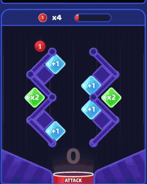
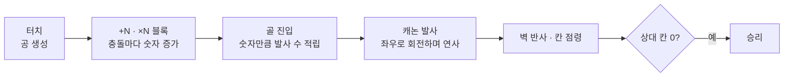
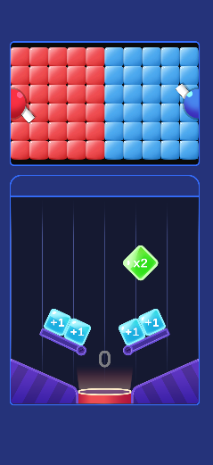
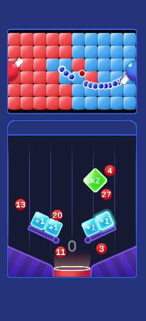
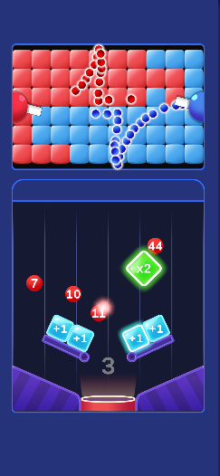

# TankBall!

공을 떨어뜨려 숫자를 키우고, 골에 들어간 숫자만큼 포탄을 쏴 상대 진영을 점령하는 모바일 하이퍼캐주얼 게임

**Day2 ROAS 130%** · MondayOFF 출시(2021.11) · [App Store](https://apps.apple.com/kr/app/tankball/id1593507763)



[게임플레이 영상 (mp4)](Media/gameplay.mp4)

| 항목 | 내용 |
|---|---|
| 기간 | 2021.10 ~ 2022.01 (4개월) |
| 팀 | 2인: Client Developer(본인) · Designer |
| 담당 | 기획 설계(메인), 클라이언트 기능 구현, 맵 레벨 디자인 15개, 출시 후 유지보수 |
| 플랫폼 | iOS · Android |
| 엔진 | Unity 2021.3 LTS (원본 프로젝트 기준) |
| 성과 | Day2 ROAS 130% |

> **이 저장소의 범위**: **핵심 메커니즘 프로토타입 C# 코드**를 포트폴리오용으로 옮겼습니다.
> 유료 에셋·아트·이펙트·사운드·씬은 라이선스와 저작권 때문에 제외했으며, 그래서 이 저장소만으로는 실행되지 않습니다.

<br>

## 1. 핵심 메커니즘: 공 → 포탄 → 점령

화면 아래 핀볼 구역에 공을 떨어뜨리고, 골에 들어간 공의 숫자만큼 위쪽 캐논이 포탄을 쏩니다. 포탄이 닿은 칸은 내 색으로 바뀌고, 상대 칸을 모두 차지하면 승리합니다.



| 단계 | 동작 | 코드 |
|---|---|---|
| 공 생성 | 터치한 x 위치에 숫자 1짜리 공을 떨어뜨림. 좌우 경계를 넘으면 양쪽 모서리 위치로 보정 | [`UI_GameScene.CreateBall`](Scripts/UI/UI_GameScene.cs#L146) |
| 숫자 증가 | 공이 `+N` 블록에 부딪히면 더하고, `×N` 블록이면 곱함. 좌우로 움직이는 블록도 있음 | [`PingpongBlock.OnCollisionEnter2D`](Scripts/Managers/Game/PingpongBlock.cs#L133) |
| 발사 수 적립 | 골에 들어간 공의 숫자를 발사 수에 더하고, 이펙트가 캐논까지 날아가 발사를 시작 | [`Goal.OnTriggerEnter2D`](Scripts/Managers/Game/Goal.cs#L5) · [`GoalProduction.ProductionRoutine`](Scripts/Managers/Game/GoalProduction.cs#L11) |
| 발사 | 좌우로 회전하는 포구에서 발사 수만큼 0.06초 간격으로 연사 | [`Cannon.FireRoutine`](Scripts/Managers/Game/Cannon.cs#L80) |
| 점령 | 포탄은 벽에 반사되며 날아가고, 상대 색 칸에 닿으면 내 색으로 바꾸고 사라짐. 상대 칸이 0이 되면 승패 결정 | [`Bullet.OnCollisionEnter2D`](Scripts/Managers/Game/Bullet.cs#L81) · [`Grid.CheckOccupation`](Scripts/Managers/Game/Grid.cs#L30) · [`Stage.SetGridCount`](Scripts/Managers/Game/Stage.cs#L46) |
| 적 AI | 3 ~ 6초(정수 초) 무작위 간격으로 10~34발을 발사(`Random.Range` 정수 오버로드라 최댓값 제외). 첫 발사는 3초 후 | [`Cannon.Update`](Scripts/Managers/Game/Cannon.cs#L35) |

이 저장소 코드로 동작하는 모습입니다.

| 대기 | 공 투하 · 적 발사 | 점령 진행 |
|:---:|:---:|:---:|
|  |  |  |
| 양 진영 칸과 캐논,<br>아래 핀볼 구역 | 공이 블록을 거치며 숫자가 커지고,<br>적 포탄이 진영을 파고듦 | 포탄이 벽에 반사되며 칸을 뒤집음 |

<br>

## 2. 설계 포인트

- **점령 판정을 칸이 직접 처리**: 포탄은 "이 칸이 내 색이 아니면 뒤집고 알려줘"만 요청하고, 칸(`Grid`)이 자기 색을 바꾼 뒤 성공 여부를 돌려줍니다. 스테이지(`Stage`)는 양 진영 칸 수만 세어 승패를 판단합니다
- **블록 효과를 데이터로 구분**: `+N`과 `×N`은 같은 `PingpongBlock` 클래스에서 종류(`Kind`)와 값(`Value`)만 바꿔 씁니다. 레벨 디자인 때 프리팹 값만 조정하면 됩니다
- **포탄 반사를 직접 계산**: 매 물리 프레임 속도를 저장해 두고, 벽에 부딪히면 그 속도를 벽의 법선으로 `Vector2.Reflect`해 새 방향을 정합니다
- **Managers 단일 진입점 + 풀링**: 공·숫자 텍스트·포탄처럼 대량으로 생성·파괴되는 오브젝트는 `Poolable`을 붙여 `Managers.Resource.Instantiate`가 풀에서 꺼내 씁니다

<br>

## 3. 구조

```
Scripts/
├─ Managers/
│  ├─ Core/                    공용 기반
│  │  ├─ Managers.cs           단일 진입점 · 하위 매니저 보관
│  │  ├─ ResourceManager.cs    로드 · 생성 · 파괴 (풀링 연동)
│  │  ├─ PoolManager.cs        Stack 기반 오브젝트 풀
│  │  ├─ Poolable.cs
│  │  ├─ UIManager.cs          씬 UI · 팝업 스택
│  │  ├─ SoundManager.cs
│  │  ├─ DataManager.cs
│  │  ├─ BaseScene.cs
│  │  └─ GameScene.cs
│  └─ Game/                    이 게임 전용
│     ├─ GameManager.cs        게임 상태 · 스테이지 · 캐논 참조
│     ├─ Stage.cs              진영별 칸 수 · 승패
│     ├─ Grid.cs               칸 한 개의 색 · 점령 처리
│     ├─ Cannon.cs             회전 · 연사 · 적 AI
│     ├─ Bullet.cs             이동 · 벽 반사 · 점령 요청
│     ├─ Ball.cs               공 숫자
│     ├─ Block.cs              블록 공통
│     ├─ PingpongBlock.cs      +N · ×N 블록, 좌우 이동
│     ├─ PingpongBlockGlow.cs  충돌 하이라이트
│     ├─ Goal.cs               골 진입 처리
│     └─ GoalProduction.cs     골 → 캐논 이펙트 · 발사 시작
├─ UI/
│  ├─ UI_Base.cs               컴포넌트 바인딩
│  ├─ UI_Scene.cs · UI_Popup.cs · UI_PopupVictory.cs
│  └─ UI_GameScene.cs          터치 · 공 생성 · 발사 수 표시
└─ Utils/
   ├─ Define.cs                경계값 · 게임 상태 · 색 · 블록 종류
   ├─ Util.cs                  자식 탐색 · 대기 캐싱
   └─ Extensions.cs            확장 메서드
```

<br>

## 4. 지금 다시 짠다면

동작 로직은 원본 그대로 두고, 지금 보이는 개선점 **5가지**를 함께 적습니다.

| # | 현재 | 문제 | 개선 방향 |
|:---:|---|---|---|
| 1 | 포탄 속도를 `_speed * Time.fixedDeltaTime`으로 계산해 `velocity`에 대입 | `velocity`는 이미 초당 이동량이라 물리 주기를 곱할 이유가 없음. 물리 주기 설정을 바꾸면 포탄 속도가 함께 바뀜 | 속도 값을 초당 이동량으로 두고 그대로 대입 |
| 2 | 블록 위치 초기화 메서드 이름이 `Reset()` | Unity가 에디터에서 컴포넌트를 추가하거나 Reset할 때 자동 호출하는 이름이라, 의도치 않게 블록 위치가 바뀔 수 있음 | `ResetPosition()`처럼 Unity 메시지와 겹치지 않는 이름 |
| 3 | 공 목록과 숫자 텍스트 목록을 인덱스로 짝지어 관리하고, 매 프레임 텍스트 위치를 공에 맞춤 | 두 목록 중 하나만 어긋나면 엉뚱한 공에 숫자가 붙음. 물리 이동 뒤 텍스트가 한 박자 늦게 따라감 | 공이 자기 숫자 표시를 소유(자식 오브젝트 또는 월드 공간 텍스트) |
| 4 | 터치 표시를 `async void` + `Task.Delay`로 끔 | 오브젝트 수명과 묶이지 않아, 대기 중 씬이 바뀌면 파괴된 오브젝트에 접근할 수 있음 | 코루틴(오브젝트와 함께 정리됨) 또는 취소 토큰 |
| 5 | 스테이지 시작 시 칸의 진영을 스프라이트 이름(`"RedBlock"`)으로 판별 | 아트 파일 이름을 바꾸면 게임 로직이 깨짐 | 칸 프리팹에 진영 값을 직렬화해 두고 그 값으로 판별 |

<br>

## 5. 출시와 운영

- 맵 레벨 15개를 직접 설계했습니다
- 프로파일러로 메모리·드로우콜을 점검해 최적화했습니다
- 리워드 광고 배치를 설계했습니다
- 결과: **Day2 ROAS 130%**
